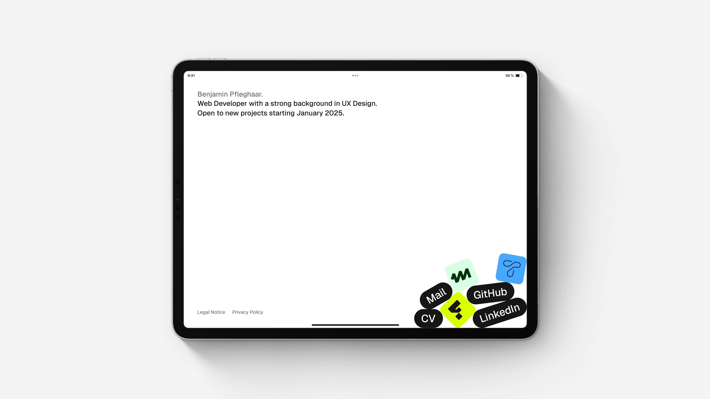

# Personal Website

Next.js personal site showcasing projects and social links, featuring playful interactive elements for exploration.



## Features

- **Dark Mode:** Automatically adapts to system settings
- **Physics Engine:** Adds realistic gravity-based interactions

## Technologies

- **Framework:** [Next.js](https://nextjs.org)
- **Styling:** [Tailwind CSS](https://tailwindcss.com)
- **Physics:** [Matter.js](https://brm.io/matter-js/)

## Getting Started

### Prerequisites

- [Node.js](https://nodejs.org) installed

### Installation

1. Clone the repository:

    ```bash
    git clone https://github.com/benjaminpfleghaar/mintly.git
    ```

2. Install dependencies:

    ```bash
    npm install
    ```

3. Run the development server:

    ```bash
    npm run dev
    ```
